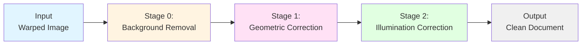

# Document Dewarping and Color Correction Pipeline

A complete, self-contained pipeline for correcting distorted and poorly-lit document images through background removal, geometric unwarping, and illumination correction.

## 📋 Overview

This pipeline combines three state-of-the-art deep learning models to transform warped, shadowed, or distorted document images into clean, flat, and evenly-lit scans suitable for OCR and archival.

### Pipeline Stages



**Stage 0: Background Removal (U2NETP Segmentation)**
- Removes background clutter via binary masking
- Isolates document region from complex backgrounds
- Uses lightweight U2NETP architecture

**Stage 1: Geometric Correction (GeoTr)**
- Unwarps distorted documents caused by camera perspective or page curvature
- Predicts backward mapping flow field
- Supports template-based correction for structured forms

**Stage 2: Illumination Correction (IllTr)**
- Removes shadows, uneven lighting, and color casts
- Patch-based processing with seamless stitching
- Restores uniform brightness and contrast

## 📚 Citations

This pipeline is built on the following research papers:

### Background Removal (U2NETP)
**U^2-Net: Going Deeper with Nested U-Structure for Salient Object Detection**
```bibtex
@article{qin2020u2net,
  title={U\^{}2-Net: Going deeper with nested U-structure for salient object detection},
  author={Qin, Xuebin and Zhang, Zichen and Huang, Chenyang and Dehghan, Masood and Zaiane, Osmar R and Jagersand, Martin},
  journal={Pattern Recognition},
  volume={106},
  pages={107404},
  year={2020},
  publisher={Elsevier}
}
```
📄 [Paper Link](https://arxiv.org/pdf/2005.09007)

### Geometric Correction (GeoTr)
**Geometric Representation Learning for Document Image Rectification**
```bibtex
@article{feng2023geometric,
  title={Geometric representation learning for document image rectification},
  author={Feng, Hao and Zhou, Wengang and Deng, Jiajun and Wang, Yuechen and Li, Houqiang},
  journal={International Journal on Document Analysis and Recognition (IJDAR)},
  pages={1--15},
  year={2023},
  publisher={Springer}
}
```
📄 [Paper Link](https://link.springer.com/article/10.1007/s10032-023-00434-x)

### Illumination Correction (IllTr)
**Document Image Shadow Removal Guided by Color-Aware Background**
```bibtex
@inproceedings{li2021document,
  title={Document Image Shadow Removal Guided by Color-Aware Background},
  author={Li, Ling and Wang, Yuechen and Deng, Jiajun and Zhou, Wengang and Li, Houqiang},
  booktitle={Proceedings of the IEEE/CVF Conference on Computer Vision and Pattern Recognition},
  pages={16348--16357},
  year={2021}
}
```
📄 [Paper Link](https://arxiv.org/pdf/2110.12942v2)

## 🚀 Quick Start

```bash
# 1. Clone this repository
cd document-dewarp-and-color-correction

# 2. Install dependencies (Python 3.8+ required)
pip install -r requirements.txt

# 3. Run the pipeline on a sample image
# Default model: geotr@doc3d (general documents)
python3 unwarp_and_correct.py --input data/1152226_geo.png

# OR use geotr@inv3d model (better for invoices/forms)
python3 unwarp_and_correct.py --input data/1152226_geo.png --model geotr@inv3d

# 4. Check the output
# Output will be saved as data/1152226_geo_corrected.png
```

## 📦 Installation

### Prerequisites
- **Python 3.8 or higher**
- **CUDA-capable GPU** (recommended for speed, but CPU mode available)
- **~250MB disk space** for model weights (included)

### Step 1: Create Virtual Environment (Recommended)
```bash
python3 -m venv venv
source venv/bin/activate  # On Windows: venv\Scripts\activate
```

### Step 2: Install Dependencies
```bash
pip install -r requirements.txt
```

### Step 3: Verify Installation
```bash
# Test with CPU mode (works on any system)
python3 unwarp_and_correct.py --input data/74053.jpg --skip-segmentation --gpu -1
```

## 🎯 Usage

### Basic Usage (All Stages)
Process an image through all three stages (background removal, unwarping, color correction):
```bash
python3 unwarp_and_correct.py --input data/1152226_geo.png
```

### Model Selection
Choose between different geometric correction models:
```bash
# Use inv3d model (better for invoices/forms with straight lines)
python3 unwarp_and_correct.py --input data/1152226_geo.png --model geotr@inv3d

# Use doc3d model (better for general documents with curved warps)
python3 unwarp_and_correct.py --input data/1152226_geo.png --model geotr@doc3d
```

### Skip Background Removal
If your image already has a clean background:
```bash
python3 unwarp_and_correct.py --input data/doc.jpg --skip-segmentation
```

### Save Intermediate Results
Keep the unwarped-only image (before illumination correction):
```bash
python3 unwarp_and_correct.py --input data/doc.jpg --save-intermediate
```

### CPU Mode
Run without GPU (slower but works on any machine):
```bash
python3 unwarp_and_correct.py --input data/doc.png --gpu -1
```

### Custom Output Path and Resolution
```bash
python3 unwarp_and_correct.py \
  --input data/1152226.jpg \
  --output ./results/clean_document.png \
  --width 2000 \
  --height 2500
```

### Template-Based Correction (For Structured Forms)
If you have a template of the expected document layout:
```bash
python3 unwarp_and_correct.py \
  --input data/warped_form.png \
  --model geotr_template@inv3d \
  --template data/template_form.png
```

### Custom Model Weights
Use different model weights:
```bash
python3 unwarp_and_correct.py \
  --input data/doc.png \
  --illtr-weights path/to/custom_illtr.pth \
  --seg-weights path/to/custom_seg.pth
```

### Save Flow Field (For Analysis)
Export the geometric transformation as a .npz file:
```bash
python3 unwarp_and_correct.py --input data/doc.png --save-flow
```

## 🎛️ Command-Line Arguments

| Argument | Short | Type | Default | Description |
|----------|-------|------|---------|-------------|
| `--input` | `-i` | `str` | **required** | Path to input warped/distorted image |
| `--output` | `-o` | `str` | `{input}_corrected.{ext}` | Path to save corrected image |
| `--model` | `-m` | `str` | `geotr@doc3d` | Geometric correction model (see table below) |
| `--template` | `-t` | `str` | `None` | Template image (required for template models) |
| `--width` | `-w` | `int` | `1700` | Output image width in pixels |
| `--height` | | `int` | `2200` | Output image height in pixels |
| `--gpu` | `-g` | `int` | `0` | GPU index (`-1` for CPU) |
| `--save-flow` | | `flag` | `False` | Save backward mapping flow field as .npz |
| `--save-intermediate` | | `flag` | `False` | Save unwarped-only image |
| `--illtr-weights` | | `str` | `DocTr/model_pretrained/illtr.pth` | IllTr model weights |
| `--seg-weights` | | `str` | `DocTr/model_pretrained/seg.pth` | Segmentation weights |
| `--skip-segmentation` | | `flag` | `False` | Skip background removal |

## 🤖 Available Models

| Model Name | Best For | Template Required | Download Size | Notes |
|------------|----------|-------------------|---------------|-------|
| `geotr@doc3d` | General documents, books, magazines | ❌ | ~80MB | Default, good all-purpose model |
| `geotr@inv3d` | Invoices, forms, receipts, structured docs | ❌ | ~80MB | Better for documents with straight edges |
| `geotr_template@inv3d` | Repeated forms with known layout | ✅ | ~80MB | Highest accuracy when template available |
| `geotr_template_large@inv3d` | Large-scale template matching | ✅ | ~120MB | Best quality, requires template |

**Note:** Template-based models will auto-download on first use if not already cached.

## 📁 Directory Structure

```
document-dewarp-and-color-correction/
├── unwarp_and_correct.py          # Main entry point script
├── requirements.txt               # Python dependencies
├── README.md                      # This file
├── README_TH.md                   # Thai version (ภาษาไทย)
├── .gitignore                     # Git ignore rules
│
├── data/                          # Sample test images
│   ├── 1152226.jpg                # Sample document 1
│   ├── 1152226_geo.png            # Sample document 1 (pre-warped)
│   ├── 74053.jpg                  # Sample document 2
│   └── S__87040009.jpg            # Sample document 3
│
├── DocTr/                         # DocTr module (illumination + segmentation)
│   ├── IllTr.py                   # IllTr illumination correction model
│   ├── seg.py                     # U2NETP segmentation model
│   └── model_pretrained/
│       ├── illtr.pth              # IllTr weights (~88MB)
│       └── seg.pth                # Segmentation weights (~5MB)
│
└── inv3d-model/                   # inv3d geometric correction module
    ├── models.yaml                # Model registry (Google Drive URLs)
    ├── models/                    # Model checkpoints
    │   ├── geotr@doc3d.ckpt       # GeoTr doc3d weights (~80MB)
    │   └── geotr@inv3d.ckpt       # GeoTr inv3d weights (~80MB)
    └── src/                       # Source code
        ├── inv3d_model/           # Model implementations
        │   └── models/            # Model zoo
        │       ├── model_factory.py   # Model loader
        │       ├── geotr/         # GeoTr models (6 files)
        │       ├── dewarpnet/     # DewarpNet models (6 files)
        │       └── identity/      # Identity baseline (2 files)
        └── inv3d_util/            # Utilities (image, mapping, etc.)
```

## 🔧 Troubleshooting

### Issue: `RuntimeError: CUDA out of memory`
**Solution:**
```bash
# Use CPU mode instead
python3 unwarp_and_correct.py --input data/doc.png --gpu -1

# Or process smaller images
python3 unwarp_and_correct.py --input data/doc.png --width 1200 --height 1600
```

### Issue: `FileNotFoundError: Model weights not found`
**Solution:**
- Verify that `DocTr/model_pretrained/illtr.pth` and `seg.pth` exist
- Check file permissions
- Re-download the repository

### Issue: `ModuleNotFoundError: No module named 'torch'`
**Solution:**
```bash
# Reinstall dependencies
pip install -r requirements.txt

# Or install manually
pip install torch torchvision pytorch-lightning==1.6.4
```

### Issue: Segmentation fails or produces poor masks
**Solution:**
```bash
# Skip segmentation if background is already clean
python3 unwarp_and_correct.py --input data/doc.png --skip-segmentation
```

### Issue: Grid artifacts or stitching lines in output
**Solution:**
- This is rare with the current implementation (exact porting from DocTr)
- If it occurs, try processing at a different resolution
- Contact maintainers with sample image

### Issue: Output has wrong colors (too blue/yellow)
**Solution:**
- Input images should be in standard RGB/BGR format
- Try converting input: `convert input.png -colorspace sRGB input_srgb.png`

### Issue: `ImportError: libGL.so.1: cannot open shared object file`
**Solution (Linux):**
```bash
# Install OpenCV dependencies
sudo apt-get update
sudo apt-get install libgl1-mesa-glx libglib2.0-0
```

## 📊 Performance

| Stage | GPU (CUDA) | CPU | Notes |
|-------|------------|-----|-------|
| Background Removal | ~0.5s | ~2s | 288×288 input |
| Geometric Correction | ~1s | ~8s | Depends on resolution |
| Illumination Correction | ~3s | ~20s | Patch-based (128×128) |
| **Total** | **~4.5s** | **~30s** | For 1700×2200 output |

*Tested on: NVIDIA RTX 3080 / Intel i7-11800H @ 2.3GHz*

## 🤝 Contributing

This is a standalone package extracted from multiple research projects. To contribute:

1. **Report issues**: Open an issue with sample images and error logs
2. **Suggest improvements**: Performance optimizations, better stitching, etc.
3. **Add models**: Integrate newer geometric/illumination correction models
4. **Documentation**: Improve README, add tutorials, create demos

## 📜 License

This package combines code from multiple sources:

- **inv3d-model**: Check `inv3d-model/LICENSE` (if present in original repo)
- **DocTr**: Check `DocTr/LICENSE.md` (if present in original repo)
- **This integration**: MIT License (for the integration script only)

**Important:** Model weights may have separate licensing terms. Please cite the original papers if used in research.

## 🙏 Acknowledgments

- **GeoTr authors**: Hao Feng, Wengang Zhou, et al. (USTC)
- **DocTr authors**: Ling Li, Yuechen Wang, et al. (USTC)
- **U^2-Net authors**: Xuebin Qin, Zichen Zhang, et al. (University of Alberta)
- **inv3d-model implementation**: Original repository contributors

## 📞 Support

For issues specific to this pipeline:
- Open an issue in this repository (if hosted on GitHub/GitLab)
- Include: Python version, OS, GPU info, full error log, sample image (if possible)

For issues with original models:
- GeoTr: [Original paper](https://link.springer.com/article/10.1007/s10032-023-00434-x)
- IllTr: [DocTr paper](https://arxiv.org/pdf/2110.12942v2)
- U^2-Net: [Paper](https://arxiv.org/pdf/2005.09007)

---

**Made with ❤️ for the document processing community**
