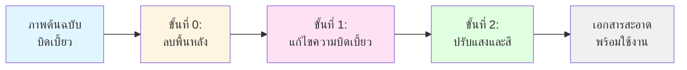

# ระบบแก้ไขเอกสารบิดเบี้ยวและปรับสีอัตโนมัติ

ระบบประมวลผลเอกสารแบบครบวงจรที่ใช้ Deep Learning ในการแก้ไขภาพเอกสารที่บิดเบี้ยว มีเงา หรือแสงไม่สม่ำเสมอ ให้กลายเป็นเอกสารที่เรียบ สะอาด พร้อมใช้งานสำหรับ OCR

## 📋 ภาพรวม

ระบบนี้รวมโมเดล Deep Learning ที่ทันสมัยที่สุด 3 โมเดลเข้าด้วยกัน เพื่อแปลงภาพเอกสารที่ถ่ายจากมือถือหรือกล้อง ที่มีความบิดเบี้ยว มีเงา หรือแสงไม่สม่ำเสมอ ให้กลายเป็นเอกสารสแกนคุณภาพสูง

### ขั้นตอนการทำงาน



**ขั้นที่ 0: ลบพื้นหลัง (U2NETP Segmentation)**
- ลบสิ่งรบกวนและพื้นหลังที่ไม่ต้องการออก
- แยกส่วนเอกสารออกจากภาพพื้นหลังที่ซับซ้อน
- ใช้โมเดล U2NETP ที่มีขนาดเล็กและเร็ว

**ขั้นที่ 1: แก้ไขความบิดเบี้ยว (GeoTr)**
- แก้ไขเอกสารที่บิดเบี้ยวจากมุมกล้อง หรือหน้ากระดาษที่โค้งงอ
- คำนวณ backward mapping flow field
- รองรับการแก้ไขแบบใช้เทมเพลต (Template) สำหรับฟอร์มที่มีโครงสร้างแน่นอน

**ขั้นที่ 2: ปรับแสงและสี (IllTr)**
- ลบเงา แสงไม่สม่ำเสมอ และสีที่ผิดเพี้ยน
- ประมวลผลแบบแบ่งเป็นชิ้นเล็ก (Patch-based) แล้วเย็บต่อกันอย่างไร้รอยต่อ
- ปรับความสว่างและคอนทราสต์ให้สม่ำเสมอทั้งภาพ

## 📚 อ้างอิงงานวิจัย

ระบบนี้พัฒนาจากงานวิจัยดังต่อไปนี้:

### การลบพื้นหลัง (U2NETP)
**U^2-Net: Going Deeper with Nested U-Structure for Salient Object Detection**
```bibtex
@article{qin2020u2net,
  title={U\^{}2-Net: Going deeper with nested U-structure for salient object detection},
  author={Qin, Xuebin and Zhang, Zichen and Huang, Chenyang and Dehghan, Masood and Zaiane, Osmar R and Jagersand, Martin},
  journal={Pattern Recognition},
  volume={106},
  pages={107404},
  year={2020},
  publisher={Elsevier}
}
```
📄 [ลิงก์เปเปอร์](https://arxiv.org/pdf/2005.09007)

### การแก้ไขความบิดเบี้ยว (GeoTr)
**Geometric Representation Learning for Document Image Rectification**
```bibtex
@article{feng2023geometric,
  title={Geometric representation learning for document image rectification},
  author={Feng, Hao and Zhou, Wengang and Deng, Jiajun and Wang, Yuechen and Li, Houqiang},
  journal={International Journal on Document Analysis and Recognition (IJDAR)},
  pages={1--15},
  year={2023},
  publisher={Springer}
}
```
📄 [ลิงก์เปเปอร์](https://link.springer.com/article/10.1007/s10032-023-00434-x)

### การแก้ไขแสงและสี (IllTr)
**Document Image Shadow Removal Guided by Color-Aware Background**
```bibtex
@inproceedings{li2021document,
  title={Document Image Shadow Removal Guided by Color-Aware Background},
  author={Li, Ling and Wang, Yuechen and Deng, Jiajun and Zhou, Wengang and Li, Houqiang},
  booktitle={Proceedings of the IEEE/CVF Conference on Computer Vision and Pattern Recognition},
  pages={16348--16357},
  year={2021}
}
```
📄 [ลิงก์เปเปอร์](https://arxiv.org/pdf/2110.12942v2)

## 🚀 เริ่มใช้งานด่วน

```bash
# 1. เข้าไปในโฟลเดอร์
cd document-dewarp-and-color-correction

# 2. ติดตั้ง dependencies (ต้องใช้ Python 3.8 ขึ้นไป)
pip install -r requirements.txt

# 3. รันโปรแกรมกับภาพตัวอย่าง
# โมเดลเริ่มต้น: geotr@doc3d (เอกสารทั่วไป)
python3 unwarp_and_correct.py --input data/1152226_geo.png

# หรือใช้โมเดล geotr@inv3d (เหมาะกับใบเสร็จ/ฟอร์ม)
python3 unwarp_and_correct.py --input data/1152226_geo.png --model geotr@inv3d

# 4. ตรวจสอบผลลัพธ์
# ไฟล์ผลลัพธ์จะถูกบันทึกเป็น data/1152226_geo_corrected.png
```

## 📦 การติดตั้ง

### สิ่งที่ต้องเตรียม
- **Python 3.8 หรือสูงกว่า**
- **GPU ที่รองรับ CUDA** (แนะนำสำหรับความเร็ว แต่สามารถใช้ CPU ได้)
- **พื้นที่ดิสก์ประมาณ 250MB** สำหรับไฟล์โมเดล (รวมอยู่ในแพ็คเกจแล้ว)

### ขั้นตอนที่ 1: สร้าง Virtual Environment (แนะนำ)
```bash
python3 -m venv venv
source venv/bin/activate  # บน Windows: venv\Scripts\activate
```

### ขั้นตอนที่ 2: ติดตั้ง Dependencies
```bash
pip install -r requirements.txt
```

### ขั้นตอนที่ 3: ทดสอบการติดตั้ง
```bash
# ทดสอบด้วยโหมด CPU (ใช้ได้กับเครื่องทุกเครื่อง)
python3 unwarp_and_correct.py --input data/74053.jpg --skip-segmentation --gpu -1
```

## 🎯 วิธีใช้งาน

### การใช้งานพื้นฐาน (ทุกขั้นตอน)
ประมวลผลภาพผ่านทั้ง 3 ขั้นตอน (ลบพื้นหลัง + แก้ไขความบิดเบี้ยว + ปรับแสงสี):
```bash
python3 unwarp_and_correct.py --input data/1152226_geo.png
```

### เลือกโมเดล
เลือกใช้โมเดลแก้ไขความบิดเบี้ยวที่เหมาะสม:
```bash
# ใช้โมเดล inv3d (เหมาะกับใบเสร็จ ฟอร์ม ที่มีเส้นตรง)
python3 unwarp_and_correct.py --input data/1152226_geo.png --model geotr@inv3d

# ใช้โมเดล doc3d (เหมาะกับเอกสารทั่วไป หนังสือ ที่มีความโค้งงอ)
python3 unwarp_and_correct.py --input data/1152226_geo.png --model geotr@doc3d
```

### ข้ามการลบพื้นหลัง
ถ้าภาพของคุณมีพื้นหลังสะอาดอยู่แล้ว:
```bash
python3 unwarp_and_correct.py --input data/doc.jpg --skip-segmentation
```

### บันทึกผลลัพธ์ระหว่างขั้นตอน
เก็บภาพที่แก้ไขความบิดเบี้ยวแล้ว (ก่อนปรับแสงสี):
```bash
python3 unwarp_and_correct.py --input data/doc.jpg --save-intermediate
```

### โหมด CPU
รันแบบไม่ใช้ GPU (ช้ากว่า แต่ใช้ได้กับเครื่องทุกเครื่อง):
```bash
python3 unwarp_and_correct.py --input data/doc.png --gpu -1
```

### กำหนดตำแหน่งไฟล์ผลลัพธ์และขนาดภาพ
```bash
python3 unwarp_and_correct.py \
  --input data/1152226.jpg \
  --output ./results/clean_document.png \
  --width 2000 \
  --height 2500
```

### แก้ไขแบบใช้เทมเพลต (สำหรับฟอร์มที่มีโครงสร้างแน่นอน)
ถ้าคุณมีไฟล์เทมเพลตของเอกสาร:
```bash
python3 unwarp_and_correct.py \
  --input data/warped_form.png \
  --model geotr_template@inv3d \
  --template data/template_form.png
```

### ใช้ไฟล์โมเดลของคุณเอง
ใช้ไฟล์โมเดลที่แตกต่างออกไป:
```bash
python3 unwarp_and_correct.py \
  --input data/doc.png \
  --illtr-weights path/to/custom_illtr.pth \
  --seg-weights path/to/custom_seg.pth
```

### บันทึก Flow Field (สำหรับการวิเคราะห์)
ส่งออกข้อมูลการแปลงรูปทรงเป็นไฟล์ .npz:
```bash
python3 unwarp_and_correct.py --input data/doc.png --save-flow
```

## 🎛️ ตัวเลือกคำสั่ง

| ตัวเลือก | ชื่อสั้น | ชนิด | ค่าเริ่มต้น | คำอธิบาย |
|----------|----------|------|-------------|----------|
| `--input` | `-i` | `str` | **จำเป็น** | ตำแหน่งไฟล์ภาพต้นฉบับที่บิดเบี้ยว |
| `--output` | `-o` | `str` | `{input}_corrected.{ext}` | ตำแหน่งบันทึกภาพผลลัพธ์ |
| `--model` | `-m` | `str` | `geotr@doc3d` | โมเดลแก้ไขความบิดเบี้ยว (ดูตารางด้านล่าง) |
| `--template` | `-t` | `str` | `None` | ภาพเทมเพลต (จำเป็นสำหรับโมเดล template) |
| `--width` | `-w` | `int` | `1700` | ความกว้างภาพผลลัพธ์ (พิกเซล) |
| `--height` | | `int` | `2200` | ความสูงภาพผลลัพธ์ (พิกเซล) |
| `--gpu` | `-g` | `int` | `0` | หมายเลข GPU (`-1` สำหรับ CPU) |
| `--save-flow` | | `flag` | `False` | บันทึก backward mapping flow เป็น .npz |
| `--save-intermediate` | | `flag` | `False` | บันทึกภาพที่แก้ไขความบิดเบี้ยวแล้ว |
| `--illtr-weights` | | `str` | `DocTr/model_pretrained/illtr.pth` | ไฟล์โมเดล IllTr |
| `--seg-weights` | | `str` | `DocTr/model_pretrained/seg.pth` | ไฟล์โมเดลแบ่งส่วน |
| `--skip-segmentation` | | `flag` | `False` | ข้ามการลบพื้นหลัง |

## 🤖 โมเดลที่รองรับ

| ชื่อโมเดล | เหมาะกับ | ต้องใช้เทมเพลต | ขนาดดาวน์โหลด | หมายเหตุ |
|-----------|----------|----------------|----------------|----------|
| `geotr@doc3d` | เอกสารทั่วไป หนังสือ นิตยสาร | ❌ | ~80MB | โมเดลเริ่มต้น ใช้ได้ดีในหลายกรณี |
| `geotr@inv3d` | ใบเสร็จ ฟอร์ม เอกสารที่มีโครงสร้าง | ❌ | ~80MB | ดีกว่าสำหรับเอกสารที่มีขอบเส้นตรง |
| `geotr_template@inv3d` | ฟอร์มซ้ำๆ ที่รู้โครงสร้าง | ✅ | ~80MB | แม่นยำสูงสุดเมื่อมีเทมเพลต |
| `geotr_template_large@inv3d` | Template matching ขนาดใหญ่ | ✅ | ~120MB | คุณภาพดีที่สุด ต้องใช้เทมเพลต |

**หมายเหตุ:** โมเดลแบบเทมเพลตจะดาวน์โหลดอัตโนมัติเมื่อใช้งานครั้งแรก (ถ้ายังไม่มีในแคช)

## 📁 โครงสร้างโฟลเดอร์

```
document-dewarp-and-color-correction/
├── unwarp_and_correct.py          # สคริปต์หลัก
├── requirements.txt               # Python dependencies
├── README.md                      # เอกสารภาษาอังกฤษ
├── README_TH.md                   # เอกสารภาษาไทย (ไฟล์นี้)
├── .gitignore                     # กฎ Git ignore
│
├── data/                          # ภาพตัวอย่าง
│   ├── 1152226.jpg                # เอกสารตัวอย่างที่ 1
│   ├── 1152226_geo.png            # เอกสารตัวอย่างที่ 1 (บิดเบี้ยวแล้ว)
│   ├── 74053.jpg                  # เอกสารตัวอย่างที่ 2
│   └── S__87040009.jpg            # เอกสารตัวอย่างที่ 3
│
├── DocTr/                         # โมดูล DocTr (แสงสี + แบ่งส่วน)
│   ├── IllTr.py                   # โมเดลปรับแสงสี IllTr
│   ├── seg.py                     # โมเดลแบ่งส่วน U2NETP
│   └── model_pretrained/
│       ├── illtr.pth              # ไฟล์โมเดล IllTr (~88MB)
│       └── seg.pth                # ไฟล์โมเดลแบ่งส่วน (~5MB)
│
└── inv3d-model/                   # โมดูลแก้ไขความบิดเบี้ยว inv3d
    ├── models.yaml                # รีจิสทรีโมเดล (Google Drive URLs)
    ├── models/                    # ไฟล์เช็คพอยต์โมเดล
    │   ├── geotr@doc3d.ckpt       # ไฟล์โมเดล GeoTr doc3d (~80MB)
    │   └── geotr@inv3d.ckpt       # ไฟล์โมเดล GeoTr inv3d (~80MB)
    └── src/                       # ซอร์สโค้ด
        ├── inv3d_model/           # โมเดลต่างๆ
        │   └── models/            # Model zoo
        │       ├── model_factory.py   # ตัวโหลดโมเดล
        │       ├── geotr/         # โมเดล GeoTr (6 ไฟล์)
        │       ├── dewarpnet/     # โมเดล DewarpNet (6 ไฟล์)
        │       └── identity/      # Baseline (2 ไฟล์)
        └── inv3d_util/            # ยูทิลิตี้ (image, mapping, ฯลฯ)
```

## 🔧 แก้ไขปัญหา

### ปัญหา: `RuntimeError: CUDA out of memory`
**วิธีแก้:**
```bash
# ใช้โหมด CPU แทน
python3 unwarp_and_correct.py --input data/doc.png --gpu -1

# หรือใช้ภาพขนาดเล็กลง
python3 unwarp_and_correct.py --input data/doc.png --width 1200 --height 1600
```

### ปัญหา: `FileNotFoundError: Model weights not found`
**วิธีแก้:**
- ตรวจสอบว่าไฟล์ `DocTr/model_pretrained/illtr.pth` และ `seg.pth` มีอยู่จริง
- ตรวจสอบ file permissions
- ดาวน์โหลดโปรเจคใหม่

### ปัญหา: `ModuleNotFoundError: No module named 'torch'`
**วิธีแก้:**
```bash
# ติดตั้ง dependencies ใหม่
pip install -r requirements.txt

# หรือติดตั้งแบบแยก
pip install torch torchvision pytorch-lightning==1.6.4
```

### ปัญหา: การแบ่งส่วนล้มเหลวหรือได้ mask ที่ไม่ดี
**วิธีแก้:**
```bash
# ข้ามการแบ่งส่วนถ้าพื้นหลังสะอาดอยู่แล้ว
python3 unwarp_and_correct.py --input data/doc.png --skip-segmentation
```

### ปัญหา: มีเส้นตารางหรือรอยต่อในภาพผลลัพธ์
**วิธีแก้:**
- ปัญหานี้หายากกับโค้ดเวอร์ชันปัจจุบัน (คัดลอกมาจาก DocTr ตรงตัว)
- ถ้าเกิดขึ้น ลองใช้ resolution ที่แตกต่างออกไป
- ติดต่อผู้ดูแลพร้อมส่งภาพตัวอย่าง

### ปัญหา: ภาพผลลัพธ์มีสีผิดเพี้ยน (น้ำเงิน/เหลืองเกินไป)
**วิธีแก้:**
- ภาพต้นฉบับควรอยู่ในฟอร์แมต RGB/BGR มาตรฐาน
- ลองแปลงสีก่อน: `convert input.png -colorspace sRGB input_srgb.png`

### ปัญหา: `ImportError: libGL.so.1: cannot open shared object file`
**วิธีแก้ (Linux):**
```bash
# ติดตั้ง OpenCV dependencies
sudo apt-get update
sudo apt-get install libgl1-mesa-glx libglib2.0-0
```

## 📊 ประสิทธิภาพ

| ขั้นตอน | GPU (CUDA) | CPU | หมายเหตุ |
|---------|------------|-----|----------|
| ลบพื้นหลัง | ~0.5 วินาที | ~2 วินาที | ขนาดภาพ 288×288 |
| แก้ไขความบิดเบี้ยว | ~1 วินาที | ~8 วินาที | ขึ้นกับ resolution |
| ปรับแสงสี | ~3 วินาที | ~20 วินาที | แบ่งเป็น patch 128×128 |
| **รวม** | **~4.5 วินาที** | **~30 วินาที** | สำหรับภาพผลลัพธ์ 1700×2200 |

*ทดสอบบน: NVIDIA RTX 3080 / Intel i7-11800H @ 2.3GHz*

## 🤝 การมีส่วนร่วม

นี่เป็นแพ็คเกจแบบ standalone ที่แยกมาจากโปรเจควิจัยหลายโปรเจค หากต้องการมีส่วนร่วม:

1. **รายงานปัญหา**: เปิด issue พร้อมภาพตัวอย่างและ error log
2. **เสนอแนะการปรับปรุง**: เพิ่มประสิทธิภาพ ปรับปรุงการเย็บภาพ ฯลฯ
3. **เพิ่มโมเดล**: รวมโมเดลแก้ไขความบิดเบี้ยว/แสงสี รุ่นใหม่ๆ
4. **เอกสาร**: ปรับปรุง README เพิ่มบทเรียน สร้างตัวอย่าง

## 📜 สิทธิ์การใช้งาน

แพ็คเกจนี้รวมโค้ดจากหลายแหล่ง:

- **inv3d-model**: ดู `inv3d-model/LICENSE` (ถ้ามีใน repo ต้นฉบับ)
- **DocTr**: ดู `DocTr/LICENSE.md` (ถ้ามีใน repo ต้นฉบับ)
- **การรวมนี้**: MIT License (สำหรับสคริปต์รวมเท่านั้น)

**สำคัญ:** ไฟล์โมเดลอาจมีเงื่อนไขสิทธิ์การใช้งานแยกต่างหาก กรุณาอ้างอิงเปเปอร์ต้นฉบับหากใช้ในงานวิจัย

## 🙏 กิตติกรรมประกาศ

- **ผู้เขียน GeoTr**: Hao Feng, Wengang Zhou, และคณะ (USTC)
- **ผู้เขียน DocTr**: Ling Li, Yuechen Wang, และคณะ (USTC)
- **ผู้เขียน U^2-Net**: Xuebin Qin, Zichen Zhang, และคณะ (University of Alberta)
- **ผู้พัฒนา inv3d-model**: ผู้มีส่วนร่วมใน repository ต้นฉบับ

## 📞 ติดต่อและสนับสนุน

สำหรับปัญหาเกี่ยวกับระบบนี้:
- เปิด issue ใน repository นี้ (ถ้าโฮสต์บน GitHub/GitLab)
- แนบข้อมูล: เวอร์ชัน Python, OS, ข้อมูล GPU, error log ทั้งหมด, ภาพตัวอย่าง (ถ้าได้)

สำหรับปัญหาเกี่ยวกับโมเดลต้นฉบับ:
- GeoTr: [เปเปอร์ต้นฉบับ](https://link.springer.com/article/10.1007/s10032-023-00434-x)
- IllTr: [เปเปอร์ DocTr](https://arxiv.org/pdf/2110.12942v2)
- U^2-Net: [เปเปอร์](https://arxiv.org/pdf/2005.09007)

---

**สร้างด้วย ❤️ สำหรับชุมชนผู้ประมวลผลเอกสาร**
